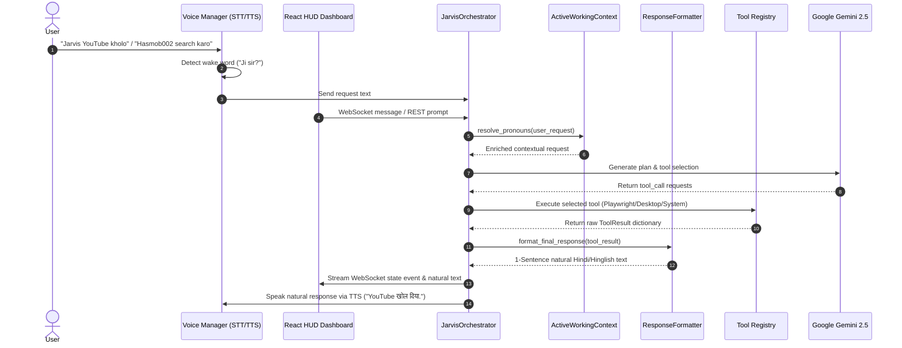

# 🤖 JARVIS — Personal AI Desktop Agent

```
   __  ___  ___  _  _____ ___ 
  / / / _ \/ _ \| |/ / _ / __|
 / /_| __ / __ /| ' / _ \__ \
 \____/_/ |_/  |_|\_/_/\_/___/
```
*Futuristic Iron-Man Style Voice Assistant for Windows*


An Iron-Man-inspired personal desktop AI assistant built with Python, FastAPI, and React for Windows. JARVIS features natural Hindi-first conversational intelligence, autonomous multi-step planning, safe system command execution via a 3-tier permission engine, Google Gemini 2.5 integration, and a futuristic sci-fi Glassmorphism HUD Dashboard with real-time WebSockets.

---

## 🌟 Primary Capabilities

1. **Hindi-First & Natural Conversational Intelligence**:
   - Default wake word activation: **`JARVIS`** (supports variations: *"Hey Jarvis"*, *"Jarvis please"*, *"Ji sir?"*).
   - Native support for Hindi (`hi-IN`), Hinglish, and English with automatic language detection (`JARVIS_AUTO_LANGUAGE_DETECTION=true`).
   - Iron-Man style natural responses capped to 1 concise sentence by default (e.g., `"Notepad खोल दिया."`, `"hasmob002 ke results mil gaye."`).
   - Proper noun protection ensuring tech terms (YouTube, VS Code, GitHub, Notepad) remain pristine.

2. **Voice Subsystem & Low-CPU Audio Engine**:
   - Sounddevice energy listener with `VOICE_ENERGY_THRESHOLD=80` for high microphone sensitivity.
   - Wake Word Activation responding in natural Hindi: **`"Ji sir?"`**.
   - Dual TTS Provider support (`pyttsx3` offline speech and `gTTS` cloud speech synthesis).
   - Dual-Pass Speech-To-Text (STT) engine trying `hi-IN` first with automatic `en-IN` fallback.
   - Optimized Sounddevice Listener loop utilizing numpy array energy calculation with yielding sleep intervals to ensure **0-2% CPU usage when idle**.

3. **Futuristic HUD React Dashboard**:
   - Sci-Fi Animated Glowing **ARC Core** (`IDLE`, `LISTENING`, `PROCESSING`, `PLANNING`, `EXECUTING`, `WAITING`, `COMPLETED`, `ERROR` state transitions).
   - Real-Time WebSocket streaming (`/ws`) for live task steps, tool executions, and system events.
   - System Telemetry panel (CPU, RAM, Disk, Battery, OS).
   - Activity Feed for step-by-step tool execution progress.
   - Interactive Chat & Command Console.
   - Confirmation Modal dialog for explicit user permission approvals.

2. **System & Computer Control**:
   - `get_system_info`: Real-time CPU, RAM, Disk, OS, & Battery metrics via `psutil`.
   - `take_screenshot`: Captures high-res screen images to disk.
   - `open_application`: Launches desktop applications (Chrome, VS Code, Notepad, Calculator, PyCharm, etc.).
   - `close_application`: Terminates target running processes cleanly by process name or PID.
   - `terminal_command`: Safe Windows PowerShell and Command Prompt sandbox with dangerous command validation.

3. **File System Management**:
   - `read_file`, `create_file`, `create_folder`, `search_files`, `rename_move_file`, `delete_file`.

5. **Persistent Memory Subsystem**:
   - `memory_save`, `memory_search`, `memory_get`, `memory_update`, `memory_delete`, `memory_list`, `memory_forget`.
   - SQLite 3 backed long-term persistent storage (`data/memory/jarvis_memory.db`) with semantic keyword search and retention policies.

6. **Screen Vision & Computer Multimodal Understanding**:
   - `screen_capture`: Instant full desktop or active window capture.
   - `screen_analyze`: Multimodal AI analysis powered by Gemini 2.5 Vision for UI understanding.
   - `screen_find_element`: Bounding box detection for clicking buttons and UI controls.

6. **Playwright Browser Automation & Session Reuse**:
   - Persistent Chromium session reuse to prevent opening duplicate windows.
   - Built-in smart selectors with fallback for YouTube search, channel navigation, video playback, and web browsing.
   - Comprehensive browser tools: `browser_open`, `browser_navigate`, `browser_search`, `browser_click`, `browser_type`, `browser_scroll`, `browser_screenshot`, and `browser_download`.

7. **Security & 3-Tier Permission Engine**:
   - **`SAFE`**: Read-only operations (telemetry, memory search, page navigation) execute automatically without user prompting.
   - **`CONFIRM`**: Modifying operations (file creation/deletion, memory updates, downloads) request explicit user token confirmation via the UI modal.
   - **`DANGEROUS`**: Dangerous commands (unrestricted shell execution, formatting, root deletion) require explicit double-step authorization.
8. **Dedicated ResponseFormatter & Clean Output Guarantee**:
   - Sanitizes tool dictionaries into human speech (e.g., converts status 200 into *"YouTube khol diya."*).
   - Intercepts raw Python dictionaries, status codes (`200`, `404`), JSON schemas, and Playwright tracebacks before TTS or user chat display.
   - Converts internal tool execution results into natural conversational Hindi/English sentences.
   - Ensures the user **NEVER** hears or sees raw debug output like `{'success': True, 'url': ...}`.

---

## 📁 Directory Structure

```
Jarvis/
├── .env                      # Local environment configuration
├── .env.example              # Template environment file
├── pyproject.toml            # Backend dependencies & pytest config
├── jarvis.spec               # PyInstaller executable build spec
├── README.md                 # Project documentation
├── jarvis/
│   ├── config.py             # Pydantic settings schema & settings manager
│   ├── cli.py                # Command-Line interactive mode
│   ├── command_bus.py        # Central event and command dispatching
│   ├── context.py            # ActiveWorkingContext & resolve_pronouns
│   ├── desktop.py            # Windows desktop application control
│   ├── launcher.py           # Single-instance application launcher
│   ├── tray.py               # Windows System Tray icon & control menu
│   ├── security/             # PermissionEngine, AuditLogger & TerminalClassifier
│   ├── brain/                # Gemini Provider, Mock Provider & ResponseFormatter
│   ├── tools/                # Registry & 14 System, File, Vision, Memory tools
│   ├── voice/                # STT, TTS, Wake Word detector & Sounddevice listener
│   ├── vision/               # Screenshot OCR & Gemini 2.5 Screen Analyzer
│   ├── memory/               # SQLite Provider & Semantic working memory
│   ├── orchestrator/         # JarvisOrchestrator, TaskPlanEngine & Agent Loop
│   └── api/                  # FastAPI App, REST Routes & WebSocket Manager (/ws)
├── frontend/
│   ├── package.json          # React, Vite, Lucide-React dependencies
│   ├── vite.config.ts        # Vite configuration & proxy settings
│   ├── src/
│   │   ├── components/       # Header, JarvisCore, Telemetry, ActivityFeed, Chat, Console, ConfirmationModal, SettingsModal
│   │   ├── hooks/            # useWebSocket, useTelemetry
│   │   ├── services/         # REST & WebSocket API client
│   │   ├── pages/            # Dashboard HUD
│   │   └── index.css         # Dark Sci-Fi HUD aesthetics & Glassmorphism
├── docs/                     # Architecture, installation & security docs
├── installer/                # Inno Setup Windows installer script (.iss)
└── tests/                    # 59 Pytest unit & integration test suite
```

---

## 🚀 Quick Start Guide

### 1. Backend Setup
Install Python dependencies:
```bash
pip install -e .[dev]
```
Configure `.env` (optional; if omitted, MockLLMProvider runs offline):
```env
GEMINI_API_KEY=your_gemini_api_key_here
LLM_MODEL=gemini-2.5-flash
MAX_AGENT_ITERATIONS=10
```

Start the FastAPI backend server:
```bash
python -m jarvis.api.app
```
*(Backend runs on `http://127.0.0.1:8000` with WebSocket endpoint `ws://127.0.0.1:8000/ws`)*

### 2. Frontend Dashboard Setup
Navigate to the `frontend/` folder and start Vite:
```bash
cd frontend
npm install
npm run dev
```
Open your browser at `http://localhost:5173` to interact with the JARVIS HUD Dashboard!

### 3. Environment Settings Reference

| Setting | Default Value | Description |
| :--- | :--- | :--- |
| `JARVIS_LANGUAGE` | `hi-IN` | Primary assistant interaction language |
| `JARVIS_SECONDARY_LANGUAGE` | `en-IN` | Secondary fallback language |
| `JARVIS_AUTO_LANGUAGE_DETECTION` | `true` | Auto-detect language from prompt input |
| `JARVIS_DEBUG_MODE` | `false` | Enable verbose internal event logging |
| `GEMINI_API_KEY` | `""` | Google Gemini API key (runs offline mock if empty) |
| `LLM_MODEL` | `gemini-2.5-flash` | Primary generative LLM model |
| `MAX_AGENT_ITERATIONS` | `10` | Maximum agent planning & execution steps |

---

## 🏗 System Architecture & Execution Flow



---

## 📡 API Reference

### REST Endpoints
- `GET /` - Root status and API metadata.
- `GET /health` - Health check endpoint.
- `GET /health` - Health check & server status.
- `POST /process` - Process a natural language request payload: `{"request": "Notepad kholo"}`.
- `POST /confirm` - Confirm a pending tool action: `{"token": "xyz", "approved": true}`.
- `GET /system/info` - Get real-time system metrics (CPU, RAM, Disk, Battery).

### WebSocket Real-Time Streaming Endpoint (`ws://localhost:8000/ws`)
- **State Events**: Emits agent state transitions (`IDLE`, `PLANNING`, `EXECUTING`, `WAITING`, `COMPLETED`).
- **Tool Events**: Emits `ToolStartedEvent`, `ToolCompletedEvent`, and `ActivityFeedEvent`.
- **Confirmation Events**: Emits `ConfirmationRequiredEvent` for interactive approvals.

---

## 🧪 Testing & Quality Assurance

Execute the complete backend test suite (59 unit tests covering 11 modules):
```bash
python -m pytest
```

Test coverage includes:
- `test_response_formatter.py`: Hindi/Hinglish language detection & zero raw dict leak verification.
- `test_voice.py`: Speech synthesis & low-CPU listener energy calculation.
- `test_context.py`: Multi-turn pronoun resolution (`"iska"`, `"channel kholo"`).
- `test_desktop.py`, `test_browser.py`, `test_vision.py`, `test_memory.py`, `test_permissions.py`, `test_tools.py`, `test_websocket.py`.

Build the React frontend production bundle:
```bash
cd frontend
npm run build
```

---

## 🗺 Roadmap & Completed Milestones

- [x] **Phase 1**: Core Modular Architecture, Tool Registry System, 3-Tier Security Engine, Gemini LLM Abstraction, Agent Loop, REST API & CLI.
- [x] **Phase 2**: Futuristic Glassmorphism React Dashboard, Circular ARC Core Animations, WebSockets `/ws`, Live Telemetry & Confirmation Modal.
- [x] **Phase 3**: Voice Module (STT, TTS Provider, `"Ji sir?"` Wake Word Activation, Sounddevice Low-CPU loop).
- [x] **Phase 4**: Playwright Browser Agent & Tab Reuse Engine (`browser_navigate`, `browser_search`, `browser_click`).
- [x] **Phase 5**: Computer Vision & Multimodal Screen Understanding (`screen_capture`, Gemini 2.5 `screen_analyze`).
- [x] **Phase 6**: Persistent Memory Subsystem (`data/memory/jarvis_memory.db` SQLite & Semantic Working Memory).
- [x] **Phase 7**: Production Windows System Tray (`pystray`) integration and single-instance launcher.
- [x] **Phase 8**: Hindi-First Natural Conversational Intelligence & Dedicated ResponseFormatter (Zero raw debug dict leaks).

---

## 📜 License

Distributed under the MIT License. See `LICENSE` for more information.

<!-- Commit 7/30: docs: detail system control tools (get_system_info, open_application) -->

<!-- Commit 8/30: docs: detail file system management capabilities -->

<!-- Commit 9/30: docs: expand Gemini 2.5 screen vision analysis section -->
